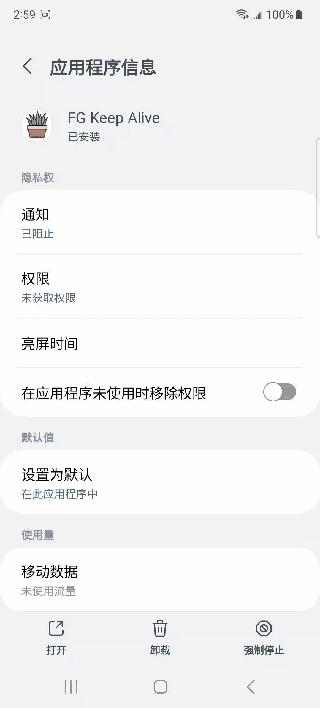
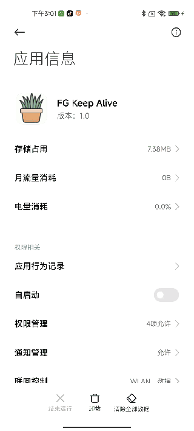
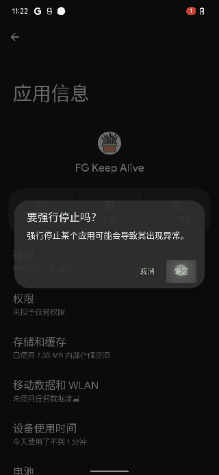

## >>>持续更新维护中>>> [2023年8月4日 18:12:46]
---
## 更新日志

---

2023年08月04日 更新：
1. 核心代码全部进入独立加密的自定义java虚拟机中执行，可以完全规避代码审核，完美过google play代码扫描。再也不用担心google代码审查带来的风险。保护核心代码安全。
2. 混淆升级，保证每次的打包代码结构都是独一无二的。
2. 后台隐藏功能升级，页面图标，后台服务，任务栏，通知栏，均可隐藏。

2023年07月17日 更新：
1. 防止应用进入深度休眠
2. 增加监听其他App启动功能，可以在其他app启动或者切换页面的时候监听到时机。

2023年6月26日 更新:
1. 保活再次升级,特别针对小米等机型优化。
2. 减小demo体积
3. 省电优化

2023年5月8日 更新：
1. 新增弹出方案,利用 binder驱动实现直接打开页面,弹出能力大幅度提升.
2. 保活能力提升,支持省电模式,节约耗电,demo默认是非省电模式.

2023年1月22日 更新：
解决由于 google play 新更新的开发者政策导致的下架问题。可稳定上架运行。

2022年7月11日更新：
支持小米 miui 12 设备

---

### Demo 下载 >>> [点这里](./Demo.apk) <<<

## 简介

2023年了，Android还有可用的保活技术吗？有，最强Android 保活方案分享！

区别于常规一像素，后台音乐等方案，本方案即使用户**点击强制停止**也**无法杀死应用**，它是基于Linux特性实现的一套**黑科技保活技术**，直达Android 保活尽头。实现**App永生**。**耗电低**，不占用CPU，保活持续时间理论上不卸载**可达永久**。即使手机关机也无法阻止！！！

支持Google play（应用市场）上架。

## **演示录屏**

| 三星 S21 Android 13       | 小米 11 Android 12             | Google Pixel 6 Pro Android 12 |
| ------------------------- | ------------------------------ | ----------------------------- |
|    |          |         |

其他没录屏的机型：

| 机型                        | Android版本         |
| --------------------------- | ------------------- |
| 华为 p40                    | 鸿蒙 2.0 Android 10 |
| 小米10 Pro                  | 10                  |
| XIAOMI 红米 7               | 9（miui 11.0.1）    |
| vivo VIVO Y3 (V1901A)       | 9                   |
| oppo R11s                   | 8.1.0               |
| HUAWEI 荣 耀30s (CDY- AN90) | 10                  |

## 功能

可以提供以下功能：均不依赖任何安卓权限授权
1. 应用保活，拒绝应用强杀，拒绝后台任务栏清理杀死，拒绝清除缓存杀死。
2. 自启动
   1. 首次安装自启动
   2. 固定时间间隔自启动
   3. 安装卸载其他应用自启动
   4. 开关机自启动
3. 后台持续保持活跃，对抗系统休眠。省电策略，可自由选择关闭。
4. 不依赖权限的后台弹框，弹出页面，activity，dialog，成功率达到 90 %。
5. 隐藏后台通知栏。隐藏通知。

## 使用要求

1. 利用Android系统特性实现，均**不依赖任何 Android 权限**。
2. 支持Android 4 - **Android 13（最新）**。
3. 对各品牌定制化 rom 有**针对性的优化**，确保达到最好效果。
4. **一行代码**即可**接入**，无需复杂调整，代码侵入低。
5. 支持代码**加固**，混淆。
6. 不可用于违法用途。

## DEMO获取&联系

请注明来意，根据以下联系方式获取：

> 邮箱：fgkeepalive@gmail.com
> 
> telegram(需要科学上网)：https://t.me/androidkeepalive
